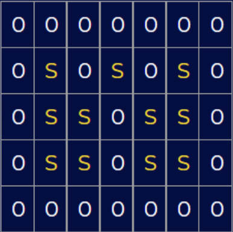

# Posture Monitoring System - PsoCuscino

This project was developed in collaboration with https://github.com/giovanni6inve , https://github.com/peppevenezia , https://github.com/alecac96

## Aim of the project

Sitting posture classifiaction for behavioral analysis of desk workers, in particuar working at PC. Data is collected from 11 FSR sensors (Force Sensitive Resistors) arranged on a chair.

## Hardware and set-up
<figure>

<figcaption>Force Sensitive Resistor (FSR).</figcaption>

</figure>

FSR sensors (strain gauges) are read by voltage partitioning on a resistance of 10kohm (Rb) and high impedence readout provided by the PSoC.

<figure>

<figcaption>Vin is 5V alimentation, the variable resistance (FSR) is Ra.</figcaption>

</figure>

The 11 sensors are iteratively read by an AMUX which feeds the analog signal for conversion to the ADC DelSig configured at 16 bit resolution, Multi Sample (since independent sensors) and 10000SPS. The sampling period is of 300ms, set by timer ISR, at which all sensors are read, sampled and sent to the GUI using UART serial communication (baud rate of 115200bps).

For easy and simple interfacing with the user (namely connection research, connected, sampling and calibration) a LED was set using a variable PWM. 

The sensor disposition upon the chair is symmetric w.r.t. the sagittal plane and while maintaining a base disposition as in figure, their precise position was optimized for maximum activation according to physiological pressure points and allowing for interuser variability: namely male/female, height ranges from 154cm to 200cm and weights from 49kg to 93kg.

<figure>

<figcaption>Where "S" stands for the FSR sensor and 0 is for the space on the hard surface, where they are attached to with tape, in between them.</figcaption>

</figure>

## Firmware (PSoC)

Connection between GUI and PSoC is dealt with automatically: the GUI sends "v" by UART, PSoC transmits "Posture$$$" in responce; if this "handshaking" (mutual recognition happens) connecion is confirmed by the GUI: "e" is received.

Once "b" is received all sensors are sampled at 3.33Hz and the 16bit value for each one is unpacked into 2 bytes for serial communication. During the first 4.5s, during which the subject is already seated, the calibration procedure takes place: it is aimed at rescaling all sensors' values by the same factor in order to exploit the whole 16 bit range, the factor is obtained dividing the desired maximum output (65535) by the actual global maximum among the sampled values for all sensors (15 samples * 11 sensors). By doing so a heavy subject and a lighter one will be associated with an equally intense heatmap (considering the values for the higher pressure points).

The synchrony and activation of all this is given by the a timer which is turned on upon "b" receval and off with "s".

## Software (GUI)
(Particular attention was given to interoperability of the whole process among different operating systems).

Upon launching the application, in order to find the port to which the PSoC is connected to, all the list of ports is iterated and the char "v" is sent to each port with a hardcoded baud rate (shared by the PSoC). Ports are passed by if a limit of time spent within them is reached; if "Posture$$$" is received connection is confirmed with that port (PSoC's one) by sending "e" to it.

To then communicate with the device a user-friendly interface is presented: "start" and "stop" buttons, which transmit "b" and "s" respectively; as for visualization, once "start" has been pressed the heatmap given by the sensors' padded and interpolated (upsampled) data is presented; and below the heatmap the posture prediction is written having as classes: "correct", "leaning forwards", "leaning backwards", "leaning right" and "leaning left". Notice the sensors' set-up, should also guarantee the recognition of crossed-legs posture but in order to train a network capable to distinguish between leaning sideways and doing so with crossed legs much more data would have been necessary to obtain satisfying performances since a more complex model would have been necessary to face the more complex task.
#### Data decoding
Each sensor value is kept in 16 bit format, so the heatmap scale goes from 0 to 65535; however since a string of 48 chars containing all sensors' data scopmosed in MSB and LSB (each then composed by 2 chars) is received, the 11 sensors values need to be re-assembled (reverse the shift and masking done at PSoC level) after cropping the head and the tail (each of 2 fixed chars).
#### Interpolation (upsampling)
Plotting only the 11 values which are sampled from the sensors is not sufficient for a clear and interpretable image, for this reason upsampling is required, the best method to replicte true weight distribution proved to be interpolation done using scipy's griddata function and an appropriate padding.

Padding is done, by linealy combining the sensors' values according to the matrix in the figure above and accounting for borders using a multiplicative decay. This was done to space the sensors' positions both from borders and from each other when feeding them to griddata which then performs a much more complex interpolation accounting for the exact positions of sensors (measured on the chair) and custom padding  (approximated from the previous measurements) and exploiting a non linear combination of values. A 41x45 image is thus obtained.

<figure>

<figcaption>GUI: buttons, heatmap, class prediction.</figcaption>

</figure>

#### Posture classification
To classify the posture among the aforementioned classes a neural network was implemented. A prediction is provided for each frame (300ms) by inserting the prediction "pipeline" within the iterating thread of the GUI which reads, interpolates and plots data. The pipeling includes data rescaling other than the actual prediction and it does so by using the parameters obtained from the training set to normalize the data and the saved model.

The model to classify each frame is a neural network which was trained,tuned and tested with data from 15 users, split in 2 disjoint and stratified sets (after informed consent signing).

The protocol to acquire the training data, and quite intuitively to label it, was to sample 1min (so 200 samples per position) in each position (after calibration) in the same order reported above.

Notice: for the model training a few considerations must be made regarding the replicability of our procedure:\
as regards data acquisitions for the training dataset (done with the above protocol) once "stop" has been pressed on the GUI the "export file" button is available and it automatically saves the User's data (name of the user to be specified when running the application from terminal where, if no data for that user has already been obtained, the corresponding folder is created) at a path related to where the code is run from, for this reason coherence in the path explicitaded in posture_net.py, when loading the data, is required.

Furthermore the data we collected is not uploaded in the repository for privacy reasons.
Regardless of this the pretrained model is uploaded for online application on new data.

<figure>

<figcaption>Model's architecture: average pooling from 41x45 (input) to 20x22; average pooling to 10x11 (similar to local baricenters extraction with decreasing resolution); flatten; dense layers (100 - 50 - 5) where the last layer has softmax activation to obtain the output probabilities of the 5 classes.</figcaption>

</figure>

## Instructions
* Connect the PSoC with thr 11 sensors properly conditioned and the LED to any USB port of the PC 
* Open the Command Prompt from `AAY2022_I_Project-2`
* Run the following lines:

        cd GUI_Python
        python plot_data_line.py User002

* Be seated before pressing "start" from the GUI since the calibrations is performed automatically in the first 4.5s

Notice: GUI_python is the Vinrtual Environment with all the libraries in `requirements.txt` so these libraries must be installed in the environment from which these codes are being launched from.

